# DIAGRAMAS TÉCNICOS - CURSO DEVOPS AVANZADO
## Diagramas Mermaid para conceptos clave

Este documento contiene diagramas técnicos en formato Mermaid que pueden ser embebidos directamente en los archivos de contenido del curso.

---

## Módulo 1: DevOps Intro

### 1.1.1: Wall of Confusion

```mermaid
graph LR
    subgraph Dev["👨‍💻 DEVELOPMENT TEAM"]
        D1["Write Code"]
        D2["New Features"]
        D3["Deploy Fast!"]
    end
    
    subgraph Wall["🧱 WALL OF CONFUSION"]
        W1["No Communication"]
        W2["Different Goals"]
        W3["Blame Culture"]
    end
    
    subgraph Ops["🔧 OPERATIONS TEAM"]
        O1["Maintain Servers"]
        O2["Ensure Uptime"]
        O3["Stability First!"]
    end
    
    Dev -->|Throws code over| Wall
    Wall -->|Friction & Delays| Ops
    
    style Dev fill:#4A90E2
    style Ops fill:#F5A623
    style Wall fill:#D0021B
```



### 1.1.2: CALMS Framework

```mermaid
graph TB
    subgraph CALMS["CALMS Framework"]
        C["🤝 CULTURE<br/>Shared Responsibility<br/>Blameless Postmortems"]
        A["⚙️ AUTOMATION<br/>CI/CD Pipelines<br/>IaC"]
        L["📊 LEAN<br/>Small Batches<br/>Continuous Flow"]
        M["📈 MEASUREMENT<br/>Metrics & SLOs<br/>Data-Driven"]
        S["💡 SHARING<br/>Knowledge Transfer<br/>Transparency"]
    end
    
    C --> A
    A --> L
    L --> M
    M --> S
    S --> C
    
    style C fill:#E8F5E9
    style A fill:#E3F2FD
    style L fill:#FFF3E0
    style M fill:#F3E5F5
    style S fill:#FCE4EC
```



---

## Módulo 2: Git Advanced

### 2.1.1: GitFlow vs Trunk-Based


### 2.1.2: Monorepo vs Polyrepo

```mermaid
graph TB
    subgraph Monorepo["🏢 MONOREPO"]
        MR["Single Repository"]
        MR --> S1["services/api"]
        MR --> S2["services/web"]
        MR --> L1["libs/auth"]
        MR --> L2["libs/utils"]
    end
    
    subgraph Polyrepo["🏠 POLYREPO"]
        R1["repo: api"]
        R2["repo: web"]
        R3["repo: auth-lib"]
        R4["repo: utils-lib"]
        
        R1 -.depends on.-> R3
        R1 -.depends on.-> R4
        R2 -.depends on.-> R3
    end
    
    style Monorepo fill:#E8F5E9
    style Polyrepo fill:#FFF3E0
```



---

## Módulo 3: CI/CD

### 3.1.1: Pipeline Declarativo

```mermaid
flowchart LR
    A["📝 Code Commit"] --> B["🔨 Build"]
    B --> C["✅ Unit Tests"]
    C --> D["🔍 Lint & SAST"]
    D --> E{"Tests Pass?"}
    E -->|Yes| F["📦 Build Artifact"]
    E -->|No| G["❌ Fail Build"]
    F --> H["🚀 Deploy to Staging"]
    H --> I["🧪 Integration Tests"]
    I --> J{"All Green?"}
    J -->|Yes| K["✨ Deploy to Prod"]
    J -->|No| L["🔄 Rollback"]
    
    style E fill:#FFF3E0
    style J fill:#FFF3E0
    style K fill:#E8F5E9
    style G fill:#FFEBEE
    style L fill:#FFEBEE
```



---

## Módul 4: IaC

### 4.1.2: Terraform State Management


---

## Módulo 6: Docker

### 6.1.2: Docker Layers


---

## Módulo 7: Kubernetes

### 7.1.1: K8s Architecture

```mermaid
graph TB
    subgraph ControlPlane["⚙️ CONTROL PLANE"]
        API["API Server"]
        ETCD["etcd"]
        SCHED["Scheduler"]
        CM["Controller Manager"]
        
        API <--> ETCD
        SCHED --> API
        CM --> API
    end
    
    subgraph Worker1["🖥️ WORKER NODE 1"]
        K1["kubelet"]
        KP1["kube-proxy"]
        P1["Pods"]
        
        K1 --> P1
        KP1 --> P1
    end
    
    subgraph Worker2["🖥️ WORKER NODE 2"]
        K2["kubelet"]
        KP2["kube-proxy"]
        P2["Pods"]
        
        K2 --> P2
        KP2 --> P2
    end
    
    API --> K1
    API --> K2
    
    style ControlPlane fill:#E8F5E9
    style Worker1 fill:#E3F2FD
    style Worker2 fill:#E3F2FD
```



### 7.1.2: Pod, Service, Ingress

```mermaid
graph LR
    U["👤 User"] -->|HTTP| I["Ingress<br/>app.example.com"]
    I --> S["Service<br/>ClusterIP"]
    S --> P1["Pod 1"]
    S --> P2["Pod 2"]
    S --> P3["Pod 3"]
    
    style I fill:#FFF3E0
    style S fill:#E8F5E9
    style P1 fill:#E3F2FD
    style P2 fill:#E3F2FD
    style P3 fill:#E3F2FD
```



---

## Módulo 8: Observability

### 8.1: The 3 Pillars

```mermaid
graph TB
    O["🔍 OBSERVABILITY"]
    O --> M["📊 METRICS<br/>Prometheus<br/>Time-series data"]
    O --> L["📝 LOGS<br/>Loki/ELK<br/>Structured JSON"]
    O --> T["🔗 TRACES<br/>Jaeger/Tempo<br/>Distributed spans"]
    
    M --> D["Grafana Dashboards"]
    L --> D
    T --> D
    
    style O fill:#F5F5F5
    style M fill:#E8F5E9
    style L fill:#E3F2FD
    style T fill:#FFF3E0
    style D fill:#F3E5F5
```



### 8.2.1: Distributed Tracing

```mermaid
sequenceDiagram
    participant U as User
    participant F as Frontend
    participant A as Auth Service
    participant AP as API Service
    participant DB as Database
    
    Note over U,DB: Trace ID: abc123
    
    U->>F: Request (200ms total)
    activate F
    F->>A: Validate Token (50ms)
    activate A
    A-->>F: Token OK
    deactivate A
    F->>AP: Get Data (100ms)
    activate AP
    AP->>DB: Query (80ms) ⚠️ SLOW
    activate DB
    DB-->>AP: Results
    deactivate DB
    AP-->>F: Data
    deactivate AP
    F-->>U: Response
    deactivate F
```



---

## Módulo 11: SRE

### 11.1.1: Error Budget

```mermaid
graph LR
    SLO["SLO: 99.9% Uptime"] --> EB["Error Budget:<br/>43.2 min/month"]
    EB --> I1["Incident 1: 20 min"]
    EB --> I2["Incident 2: 15 min"]
    EB --> R["Remaining: 8.2 min"]
    
    R -->|Budget Low| FREEZE["🚫 Deploy Freeze<br/>Focus on Reliability"]
    R -->|Budget OK| DEPLOY["✅ Continue Deploys"]
    
    style SLO fill:#E8F5E9
    style EB fill:#FFF3E0
    style FREEZE fill:#FFEBEE
    style DEPLOY fill:#E8F5E9
```



---

## Instrucciones de Uso

Para embeber estos diagramas en los archivos de contenido:

1. Copia el bloque Mermaid correspondiente
2. Pégalo en el archivo `*_contenido.md` apropiado
3. El diagrama se renderizará automáticamente en plataformas que soporten Mermaid (GitHub, GitLab, etc.)

Para generar imágenes PNG de los diagramas:
```bash
# Usando mermaid-cli
mmdc -i diagram.md -o diagram.png
```
